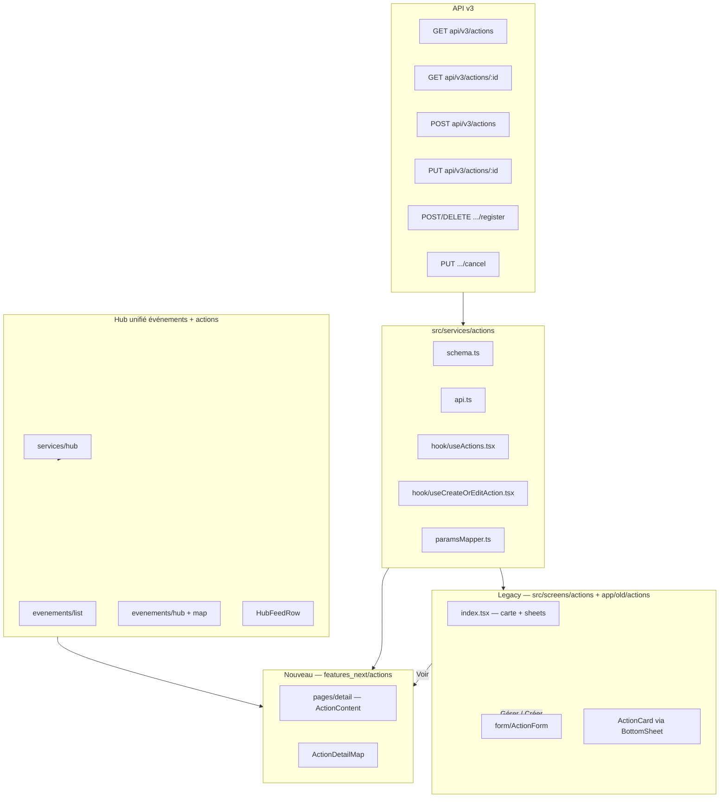
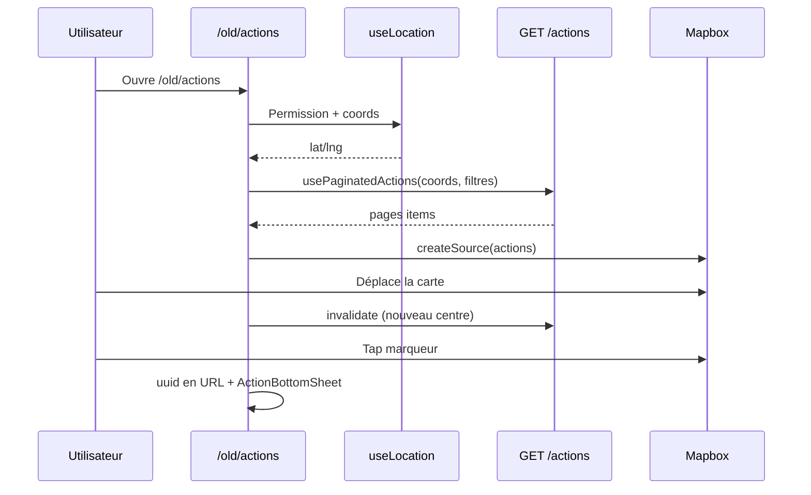
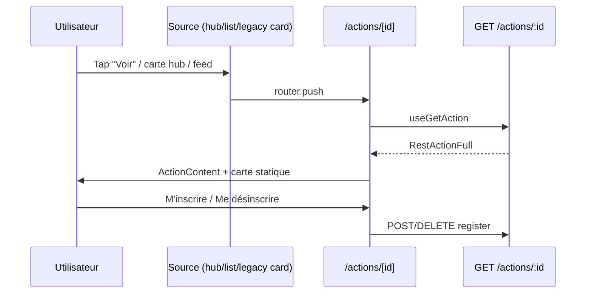

# Audit — Actions territoriales (implémentation actuelle)

> Document de référence pour la migration vers le nouveau layout / maquette.  
> Dernière mise à jour : mai 2026.

---

## 1. Synthèse exécutive

L’écosystème **Actions** (porte-à-porte, tractage, boîtage, collage) est **scindé en deux implémentations** :

| Zone | Statut | Rôle |
|------|--------|------|
| **`/old/actions`** | Legacy, écran principal carte + liste | Hub carte, filtres géo, création/édition modale, bottom sheets |
| **`/actions/[id]`** (`features_next`) | Partiellement migré | Détail action (layout `AppStructure`, mobile/desktop) |
| **Hub événements** (`/evenements/*`) | Nouveau layout | Actions **mélangées** avec les événements (liste, carte, feed) — pas d’écran Actions dédié |

**Ce qui est déjà sur le nouveau modèle :** détail (`ActionContent`), carte statique sur le détail, partage, inscription/désinscription, navigation depuis hub/feed/home.

**Ce qui reste sur l’ancien modèle :** liste paginée géolocalisée, carte interactive multi-actions, filtres période/type/adresse, création/édition/annulation (formulaire dans modale), entrée menu profil dev → `/old/actions`.

**À ne pas confondre :** le dossier `app/old/actions/` contient aussi **Phoning** et **Ripostes** (`retaliation`) — ce ne sont **pas** les actions territoriales v3, mais d’anciennes features regroupées sous le même préfixe de route.

---

## 2. Schéma d’architecture

---

## 3. Modèle de données & API

### 3.1 Types d’action

| Enum | Slug API | Libellé UI |
|------|----------|------------|
| `PAP` | `pap` | Porte à Porte |
| `BOITAGE` | `boitage` | Boîtage |
| `TRACTAGE` | `tractage` | Tractage |
| `COLLAGE` | `collage` | Collage |

Fichier source : `src/services/actions/schema.ts`

### 3.2 Statuts

- `scheduled` — action planifiée
- `cancelled` — annulée (chip orange « Annulée »)

### 3.3 Formes de réponse

| Type | Champs distinctifs | Usage |
|------|-------------------|--------|
| `RestAction` (liste / pagination) | `participants_count`, `first_participants` | Cartes liste, marqueurs carte |
| `RestActionFull` (détail) | `description`, `editable`, `participants[]` | Détail, bottom sheet étendu, formulaire édition |

Guards : `isFullAction()`, `isPaginatedActionItems()`.

### 3.4 Endpoints (`src/services/actions/api.ts`)

| Méthode | Path | Hook / usage |
|---------|------|----------------|
| GET | `api/v3/actions` | `usePaginatedActions` — `longitude`, `latitude`, filtres date/type, `subscribeOnly` |
| GET | `api/v3/actions/:id?scope=` | `useAction`, `useGetAction` (suspense) |
| POST | `api/v3/actions?scope=` | `useCreateOrEditAction` (création) |
| PUT | `api/v3/actions/:id?scope=` | `useCreateOrEditAction` (édition) |
| POST | `api/v3/actions/:id/register` | `useSubscribeAction` |
| DELETE | `api/v3/actions/:id/register` | `useUnsubscribeAction` |
| PUT | `api/v3/actions/:id/cancel?scope=` | `useCancelAction` |

**Scope :** dérivé de la session — premier scope dont `features` contient `'actions'`.

### 3.5 Filtres liste (pagination)

Périodes (`SelectPeriod`) mappées vers query `date[after]` / `date[before]` (`paramsMapper.ts`) :

| UI | Comportement API |
|----|------------------|
| `to-come` (défaut) | `date[after]` = maintenant |
| `today` | journée courante |
| `tomorow` | lendemain (typo conservée dans le code) |
| `past` | `date[before]` = début du jour |

Types : `FilterActionType` (`all`, `pap`, `boitage`, …).

**Prérequis géo :** `usePaginatedActions` ne fetch que si `latitude` et `longitude` sont des nombres (`isEnabled`).

### 3.6 Cache & optimistic updates

- Clés : `QUERY_KEY_PAGINATED_ACTIONS`, `QUERY_KEY_ACTIONS`
- Inscription : met à jour pagination + détail + **timeline feed** (`optimisticToggleSubscribe` dans `helpers.ts`)
- Création/édition : `optimisticUpdate` sur les deux clés

### 3.7 Erreurs formulaire

`ActionFormError` + `propertyPathSchema` — violations mappées sur les champs react-hook-form.

---

## 4. Routes & navigation

### 4.1 Table des routes

| Route | Fichier | Description |
|-------|---------|-------------|
| `/old/actions` | `app/old/actions/index.tsx` | **Écran principal legacy** — carte Mapbox, liste, modale CRUD |
| `/old/actions?uuid=&action=create\|edit&scope=` | idem | Deep links création/édition |
| `/actions/[id]` | `app/(app)/actions/[id].tsx` | **Détail nouveau layout** |
| `/evenements/list` | `app/(app)/evenements/list.tsx` | Liste hub (événements + actions) |
| `/evenements/hub` | `app/(app)/evenements/hub.tsx` | Carte hub unifiée |
| `/evenements/map` | `app/(app)/evenements/map.tsx` | Carte (clic action → détail) |
| `/(tabs)/evenements` | feed | Feed événements (pas d’actions seules) |

### 4.2 Menu & accès

| Entrée | Destination | Note |
|--------|-------------|------|
| Nav militant principal | — | Item Actions **commenté** (`navigationItems.ts` L71) |
| Menu cadre `FEATURES.ACTIONS` | URL externe `/actions` | `displayIn: 'never'` |
| Profil dev « Anciens outils » | `/old/actions` | `features_next/profil/components/Layout.tsx` |
| `protectedRoutes` | `'/(tabs)/actions'` | Route tabs **non présente** dans `app/(app)` actuel |

### 4.3 Redirections auth

- `/old/actions` : si non connecté → `/(tabs)/evenements/`
- Tablette paysage (non-web, `gtMd`) : message « Tournez votre appareil en mode portrait »

---

## 5. Couche UI — Legacy (`src/screens/actions`)

### 5.1 Inventaire des fichiers

| Fichier | Rôle |
|---------|------|
| `index.ts` | Barrel exports |
| `ActionMapView.tsx` | Carte Mapbox, marqueurs dynamiques (`generated-markers-lib`) |
| `utils.ts` | `mapPayload`, `createSource`, `useSheetPosition`, `passType` |
| `BottomSheetList.tsx` | `ActionList`, `BottomSheetList`, `SideList` |
| `ActionBottomSheet.tsx` | `ActionBottomSheet` (mobile), `SideActionList` (desktop) |
| `ActionFiltersList.tsx` | Filtres adresse / période / type |
| `CreateEditModal.tsx` | Wrapper `ModalOrPageBase` + `ActionForm` |
| `form/ActionForm.tsx` | Formulaire création/édition/annulation |
| `form/schema.ts` | Validation Zod client |
| `ActionCreateButton.tsx` | FAB « Créer une action » |
| `ActionTypeEntry.tsx` | Tuile sélection type |
| `ActionParticipants.tsx` | Avatar participant |
| `EmptyAction.tsx` | Empty state liste |

### 5.2 Écran carte (`app/old/actions/index.tsx`)

**État local / URL :**

- `uuid` (search param) — action sélectionnée sur la carte
- `action=create|edit` — ouvre la modale formulaire
- `scope` — scope explicite ou premier scope « actions »
- Filtres : `period`, `type` (state React)
- `activeTab` : `'actions' | 'myActions'` — **fixé à `'actions'`** (tabs « J'y participe » commentés)
- `listOpen`, `followUser`, position bottom sheet

**Layout responsive :**

| Breakpoint | Liste | Détail sélection | Filtres | Création |
|------------|-------|------------------|---------|----------|
| `md` (mobile) | `BottomSheetList` | `ActionBottomSheet` | Overlay carte si pas d’action active | FAB bas droite |
| `gtMd` (desktop) | `SideList` (panneau gauche) | `SideActionList` | Dans le panneau liste | Bouton dans side list |

**Carte :**

- Recentrage sur déplacement caméra (> 1 km) → invalide `QUERY_KEY_PAGINATED_ACTIONS`
- Clic marqueur → zoom + ouverture détail sheet
- Clic carte vide → désélection + réouverture liste
- Bouton GPS (natif) → recentre sur position utilisateur
- Marqueurs : script `scripts/prepare-action-markers.ts` → `assets/images/generated-markers-lib.ts` (états : normal, active, passed, cancelled × 4 types)

### 5.3 Composant carte partagé

`ActionCard` (`src/components/Cards/ActionCard/ActionCard.tsx`) :

- Mode liste : boutons « Voir » + « Gérer » (auteur) ou `SubscribeButton`
- Mode `asFull` : contenu enrichi (children) — description, participants dans les sheets
- `SubscribeButton` : debounce 300 ms, hooks subscribe/unsubscribe

**Mapping données :** `mapPayload()` dans `screens/actions/utils.ts`.

---

## 6. Couche UI — Nouveau (`src/features_next/actions`)

### 6.1 Inventaire

| Fichier | Rôle |
|---------|------|
| `pages/detail/index.tsx` | Shell : `ActionDetailsScreen`, skeleton, deny |
| `pages/detail/components/ActionContent.tsx` | Layout mobile / desktop |
| `pages/detail/components/ActionDetailMap.tsx` | Carte statique (pins PNG dédiés) |
| `pages/detail/components/ActionSkeleton.tsx` | Chargement |
| `pages/detail/components/ActionDenyScreen.tsx` | 401/403/404 |
| `utils/formatActionDetailTitle.ts` | Titre « Porte à Porte Vendredi 15 mai 14h00 » |
| `assets/map/action-*.png` | Pins détail + hub carte (réutilisés par `HubItemMap`) |

### 6.2 Détail — structure UI

**Mobile (`media.sm`) :**

- Carte en tête (250px + safe area top)
- Chips type / annulée / terminée
- Titre formaté, description markdown
- Date, lieu
- Participants + `DetailShareGroup`
- CTA fixe bas : inscription ou « Éditer » si `editable` et `onEdit` fourni
- Bouton retour flottant

**Desktop :**

- 2 colonnes dans `VoxCard` : info (+ participants) | CTA + meta + partage
- `ContentBackButton`

**Non branché sur la route actuelle :** `onEdit` n’est **pas** passé depuis `app/(app)/actions/[id].tsx` → bouton « Éditer » absent en production sur le détail nouveau (contrairement au bottom sheet legacy qui ouvre la modale).

### 6.3 Route détail

`app/(app)/actions/[id].tsx` :

- `Layout.Container` + `hideTabBar`
- `useGetAction` (suspense) + scope
- Meta OG / title

---

## 7. Intégrations transverses

### 7.1 Hub événements (`services/hub`)

- API hub unifiée — items type action vs event (`isHubActionItem`, `isHubEventItem`)
- `mapHubItemToActionCardPayload` → payload `ActionCard`
- `mapHubItemToFeedRow` → `{ type: 'action', payload }` dans les listes
- `mapHubItemToMapMarker` → `itemType: 'action'` + `actionType` pour pins

**Fichiers consommateurs :**

- `features_next/events/pages/list` — `HubFeedRow`
- `features_next/events/pages/hub` — carte + desktop/mobile hub
- `features_next/events/pages/map` — clic → `/actions/[id]`
- `features_next/events/components/list-item/HubFeedRow.tsx`

**Limite hub feed :** les cartes action dans `HubFeedRow` n’exposent **pas** `onEdit` / `isMyAction` (seulement `onShow`).

### 7.2 Fil d’actualité accueil (`helpers/homeFeed.ts`)

| Action | Navigation |
|--------|------------|
| Voir | `/actions/[id]` |
| Gérer (édition) | `/old/actions?uuid=&action=edit` |

### 7.3 Partage

`DetailShareGroup` — URL `https://{ASSOCIATED_DOMAIN}/actions/{uuid}?ref={profileId}`

### 7.4 Composant feed générique

`FeedCard` type `'action'` → délègue à `ActionCard` (timeline / autres feeds).

---

## 8. Flux utilisateur détaillés

### Flux A — Découvrir des actions sur la carte (legacy)

### Flux B — Voir le détail (nouveau)

### Flux C — Créer une action (legacy uniquement)

1. `/old/actions` → FAB ou `?action=create`
2. `CreateEditModal` → `ActionForm` (sans uuid)
3. Choix type, date/heure, adresse (autocomplete ou manuel), description
4. `useCreateOrEditAction` → POST + toast + fermeture modale
5. Optimistic update cache

**Entrées alternatives :** menu profil dev, deep link avec `scope` query param.

### Flux D — Modifier / annuler (legacy uniquement)

1. Liste ou sheet → « Gérer » / « Editer »
2. `?uuid=X&action=edit` ou modale déjà ouverte
3. `ActionForm` prérempli via `useAction(uuid)`
4. Modifier → PUT | Annuler → `useCancelAction` (PUT cancel) puis fermeture

**Feed accueil « Gérer »** → redirige vers flux D via `/old/actions`.

### Flux E — S’inscrire sans ouvrir le détail

- `ActionCard` / `SubscribeButton` dans liste legacy, bottom sheet, ou carte (si rendu)
- Possible depuis hub list **si** boutons ajoutés (actuellement hub = Voir seulement)

### Flux F — Hub événements (nouveau layout)

1. `/evenements/list` ou `/evenements/hub` ou `/evenements/map`
2. Items actions mélangés aux événements (même API hub)
3. Clic → `/actions/[id]` (pas de création depuis hub)

---

## 9. Comparaison avec Événements (cible migration)

Référence : `src/features_next/events/` + routes `app/(app)/evenements/*`.

| Capacité | Événements (nouveau) | Actions (actuel) |
|----------|----------------------|----------------|
| Feed tab | `/(tabs)/evenements` | ❌ Pas de tab Actions |
| Liste dédiée | `/evenements/list` (hub) | ❌ Seulement via hub ou `/old/actions` |
| Carte dédiée | `/evenements/hub`, `/evenements/map` | ❌ Legacy `/old/actions` ou pins dans hub |
| Détail | `/evenements/[id]` | ✅ `/actions/[id]` |
| Création | `/evenements/creer` | ❌ Modale legacy seulement |
| Édition | `/evenements/[id]/modifier` | ❌ Modale legacy / deep link old |
| Filtres store | `filterStore.ts` | State local page old |
| Layout | `AppStructure/Layout` | Détail oui ; hub/list legacy layout mixte |

**Pattern à reproduire pour Actions :** routes `(app)/actions/*` miroir événements, composants sous `features_next/actions/pages/{feed,list,hub,map,create-edit}`, réutilisation progressive de `screens/actions` (utils, form) ou migration du form.

---

## 10. Sous-routes `app/old/actions` (hors scope territorial)

Ces features partagent le préfixe `/old/actions` mais **ne passent pas** par `services/actions` v3 :

| Dossier | Feature | Écrans |
|---------|---------|--------|
| `phoning/` | Phoning campagnes | charter, tutorial, session device, poll, call status… |
| `retaliation/` | Ripostes | `RetaliationsScreen`, `[id]` |

À traiter comme migration **séparée** (ou conservation sous `old/`).

---

## 11. Écarts & dette technique (checklist migration)

### 11.1 Fonctionnel

- [ ] Écran liste/carte Actions dans `features_next` (équivalent `/old/actions`)
- [ ] Routes `actions/list`, `actions/hub`, `actions/map`, `actions/creer`, `actions/[id]/modifier`
- [ ] Brancher `onEdit` sur `ActionContent` → formulaire nouveau layout (pas seulement modale old)
- [ ] Unifier « Gérer » feed accueil → nouvelle route édition
- [ ] Réactiver ou remplacer tab « J'y participe » (`subscribeOnly`) — code présent mais UI commentée
- [ ] `HubFeedRow` : boutons Gérer / inscription si maquette le prévoit
- [ ] Item menu militant « Actions » (actuellement commenté)
- [ ] Aligner marqueurs carte : sprites legacy vs PNG `features_next/actions/assets`

### 11.2 Technique

- [ ] `useCancelAction` : `scope` non passé à l’API (vérifier contrat backend)
- [ ] Typo `tomorow` dans `SelectPeriod`
- [ ] `isMyAction` : legacy compare `author.uuid`, nouveau détail utilise `editable` — s’assurer de la cohérence API
- [ ] Double implémentation détail (bottom sheet vs `ActionContent`) — fusionner comportements (participants, CTA)
- [ ] `protectedRoutes` `/(tabs)/actions` orphelin

### 11.3 Tests manuels suggérés

1. Liste legacy : filtres, pagination, empty state, permission localisation
2. Création / édition / annulation + erreurs champs API
3. Inscription optimistic (liste + détail + timeline)
4. Détail nouveau : mobile/desktop, action passée, annulée, sans description
5. Hub : clic action liste + carte → détail
6. Feed accueil : Voir + Gérer
7. Partage URL + ref
8. Non-auth : redirections

---

## 12. Index des fichiers clés

### Services
- `src/services/actions/schema.ts`
- `src/services/actions/api.ts`
- `src/services/actions/paramsMapper.ts`
- `src/services/actions/error.ts`
- `src/services/actions/hook/useActions.tsx`
- `src/services/actions/hook/useCreateOrEditAction.tsx`
- `src/services/actions/hook/helpers.ts`
- `src/services/hub/mapper.ts` (actions dans hub)

### Routes
- `app/old/actions/index.tsx`
- `app/old/actions/_layout.tsx`
- `app/(app)/actions/[id].tsx`

### UI Legacy
- `src/screens/actions/**`
- `src/components/Cards/ActionCard/**`

### UI Nouveau
- `src/features_next/actions/**`

### Intégrations
- `src/helpers/homeFeed.ts`
- `src/features_next/events/pages/list/index.tsx`
- `src/features_next/events/pages/hub/index.tsx`
- `src/features_next/events/components/list-item/HubFeedRow.tsx`
- `src/components/ShareGroup/DetailShareGroup.tsx`

### Assets / build
- `scripts/prepare-action-markers.ts`
- `assets/images/generated-markers-lib.ts`
- `src/features_next/actions/assets/map/*.png`

---

## 13. Matrice des points d’entrée → destination

| Point d’entrée | Action utilisateur | Destination |
|----------------|-------------------|-------------|
| `/old/actions` | Parcourir carte/liste | Reste sur old |
| Carte/liste old | Voir | `/actions/[id]` |
| Carte/liste old | Gérer | Modale edit (uuid URL) |
| FAB old | Créer | Modale create |
| `/actions/[id]` | Voir détail | Nouveau layout |
| Hub list/map | Clic item action | `/actions/[id]` |
| Feed accueil | Voir | `/actions/[id]` |
| Feed accueil | Gérer | `/old/actions?action=edit` |
| Profil dev | Actions | `/old/actions` |
| Menu cadre (externe) | Actions | Site web `/actions` |

---

*Pour toute évolution de ce document, mettre à jour les sections 11 et 13 au fil de la migration.*
